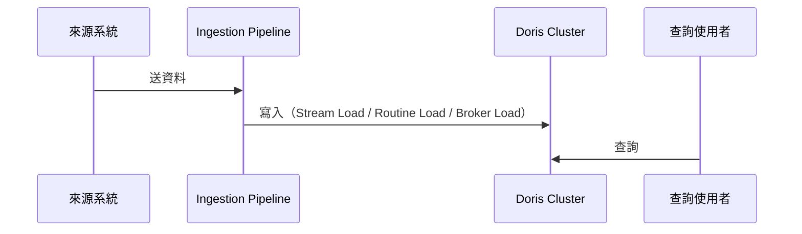

# Data Flow：<服務名稱>

> 來源：PRD.md（Phase 8 衍生）

## 資料流總覽

## 各階段說明
### 1. 資料來源
- 支援哪些來源（Kafka、檔案、其他資料庫 CDC 等）

### 2. Ingestion Pipeline
- 使用的匯入方式與選型理由
- Schema 驗證/轉換邏輯
- 錯誤處理與重試策略（對應 edge-case-checklist 的結論）

### 3. 儲存與模型設計
- 資料模型類型（Duplicate/Aggregate/Unique Key）選型理由
- 分區/分桶策略

### 4. 查詢路徑
- 使用者/下游系統如何查詢（BI 工具、API、直連）

## 資料生命週期
- 保留期限、冷熱資料分層、過期資料清除機制

## 監控與可觀測性
- 關鍵指標（延遲、失敗率、堆積量）與告警門檻
